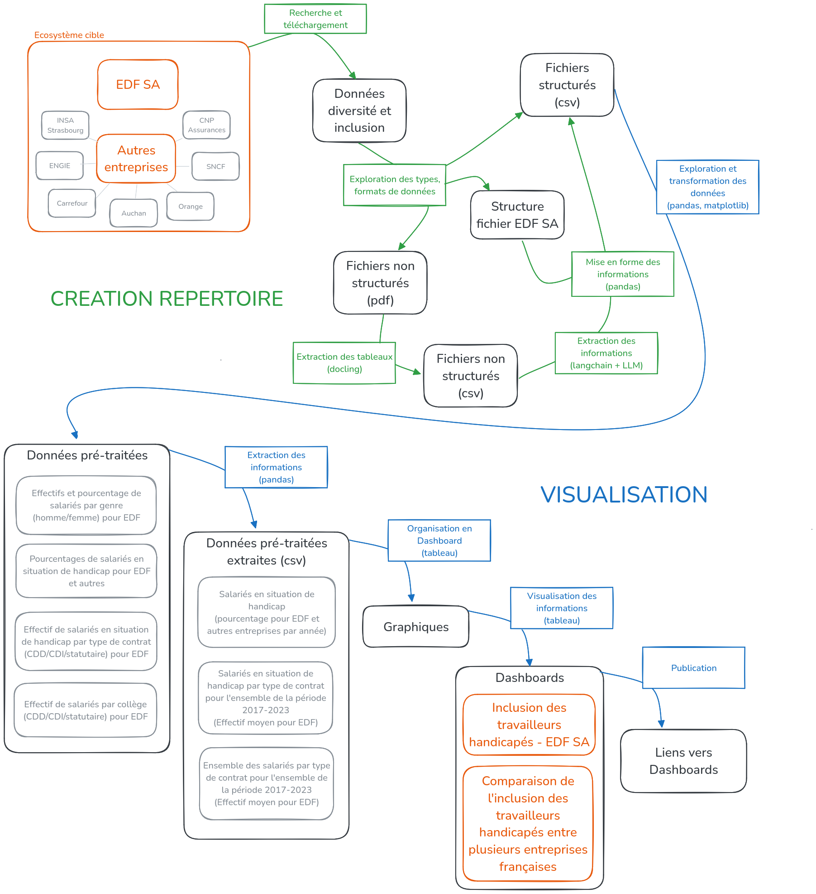

# Projet Open Data University (ODU) 

https://www.opendatauniversity.org/

## Diversité et inclusion en entreprise 

https://defis.data.gouv.fr/defis/diversite-et-inclusion-en-entreprise

Thématique sélectionnée : inclusion des personnes en situation de handicap

Problématiques générales :  
- Quelles sont les caractéristiques importantes et évolutions clés du bilan social d’EDF SA sur l’inclusion et la diversité au sein de l’entreprise ?
- Comment EDF SA se situe sur ces sujets par rapport à des entreprises comparables en France, en Europe ou même ailleurs dans le monde ?

Ces problématiques sont appliquées au cas des salariés en situation de handicap.

Missions prises en charge :

- Mission 1 (Réalisation 1 du défi) : **Analyse de données - focus sur les salariés en situation de handicap**  
- Mission 2 (Réalisation 2 du défi) : **Répertoire des bilans sociaux de grandes entreprises - focus sur les salariés en situation de handicap**  

Notebooks associés : 

- Mission 1 - données internes EDF : **notebooks/preprocess_data_dashboard_EDF.ipynb**
- Mission 1 - données entreprises françaises : **notebooks/preprocess_data_dashboard_toutes_entreprises.ipynb**
- Mission 2 : **notebooks/repertoires_entreprises_pipeline_complet.ipynb**

### Données 

Données sélectionnées :  

- Données générales des effectifs d'EDF https://defis.data.gouv.fr/datasets/66e380b07889d3b365709382
- Données des salariés en situation de handicap d'EDF https://defis.data.gouv.fr/datasets/66e380b07889d3b365709384

Données supplémentaires : 

- Données d'EDF et d'autres entreprises, données produites au cours du projet https://drive.google.com/drive/folders/1UzNH47lA8ApVKCR_-MTaHS73KFRbpN1R?usp=drive_link

### TODO

|N° Mission|N° Tâche|Statut|Description tâche|
|----------|--------|------|-----------|
|-|1|Done|Définition de la problématique et sélection cas d'étude|
|-|2|Done|Mise en place du projet / travail en collaboration|
|-|-|-|-|
|1|1|Done|Téléchargement et exploration simple des données|
|1|2|Done|Exploration des données des effectifs totaux|
|1|3|Done|Exploration des données des effectifs des salariés en situation de handicap|
|1|4|Done|Sélection et test de visualisations en accord avec la problématique|
|1|5|Done|Transformation des données pour les visualisations|
|1|6|Done|Aggrégation avec les données de toutes les entreprises|
|1|7|Done|Extraction des données pour l'implémentation Tableau|
|1|8|Done|Visualisation Tableau et construction des Dashboard|
|-|-|-|-|
|2|1|Done                   |Téléchargement et exploration sommaire des données EDF|
|2|2|Done                   |Etablissement de l'environnement de travail|
|2|3|Done                   |Choix des librairies / outils et premiers tests|
|2|3.1|Done                 |Test de docling pour extraire les tableaux de données des pdf|
|2|3.2|Done                 |Test de LangChain pour extraire les informations des csv|
|2|4|Done                   |Téléchargement et exploration sommaire des données d'autres entreprises|
|2|4.1|Done                 |Liste d'autres entreprises et liens vers leurs données|
|2|4.2|Done                 |Téléchargement des données (fichiers pdf/csv)|
|2|5|A faire                |Automatisation du téléchargement des données|
|2|6|Done                   |Evaluer la possibilité d'utiliser un outils d'extraction depuis pdf pour extraire les données|
|2|6.1|Done                 |Extraction des tableaux des fichiers pdf en csv|
|2|7|Done                   |Evaluer la possibilité d'utiliser un LLM pour extraire les données|
|2|7.1|Done                 |Installation et set-up de LangChain et d'un premier modèle|
|2|7.2|Done                 |Test du modèle de Ollama Qwen2.5|
|2|7.3|Done                 |Modification du prompt pour obtenir les informations recherchées depuis les fichiers csv|
|2|7.4|Done                 |Evaluation du prompt pour tous les fichiers d'une même entreprise - Exemple d'Auchan|
|2|7.5|Done                 |Evaluation du prompt pour tous les fichiers de toutes les entreprises|
|2|7.6|Done                 |Optimisation du prompt pour tous les fichiers de toutes les entreprises|
|2|8|Done                   |Nettoyage des données de sortie du prompt|
|2|8.1|Done                 |Obtention d'un dataframe avec nombre, % et années|
|2|8.2|Done                 |Transformation du dataframe (type, valeurs, disposition) pour correspondre aux données d'EDF|
|2|9|Done                |Implémenter le pipeline entier des fichiers pdf aux df finaux puis csv avec données compilées|
|-|-|-|-|

### Organigramme du projet 

## Verrous, perspectives 

Donnés dans les notebooks associés aux missions.

## Liens vers les Dashboards

### Inclusion des salariés en situation de handicap - cas d'EDF 

https://public.tableau.com/app/profile/maria.thiam/viz/employs_par_contrat/DashboardcompratifEDF

### Inclusion des salariés en situation de handicap - comparaison d'EDF et d'autres entreprises françaises

https://public.tableau.com/app/profile/maria.thiam/viz/pourcentagehandicapsentrepriseann/comparaisonEDFvsautres

## Lien vers les données 

https://drive.google.com/drive/folders/1UzNH47lA8ApVKCR_-MTaHS73KFRbpN1R?usp=drive_link

Le dossier "data" doit être placé à la racine du projet, au même niveau que le dossier "notebooks".

## Environnement de travail 

Pré-recquis : installation d'uv (https://github.com/astral-sh/uv) et ollama (https://ollama.com/).

>git clone git@github.com:LexouLam/diversite_inclusion.git  
>cd diversite_inclusion  
>uv venv --python 3.12  
>uv sync  

